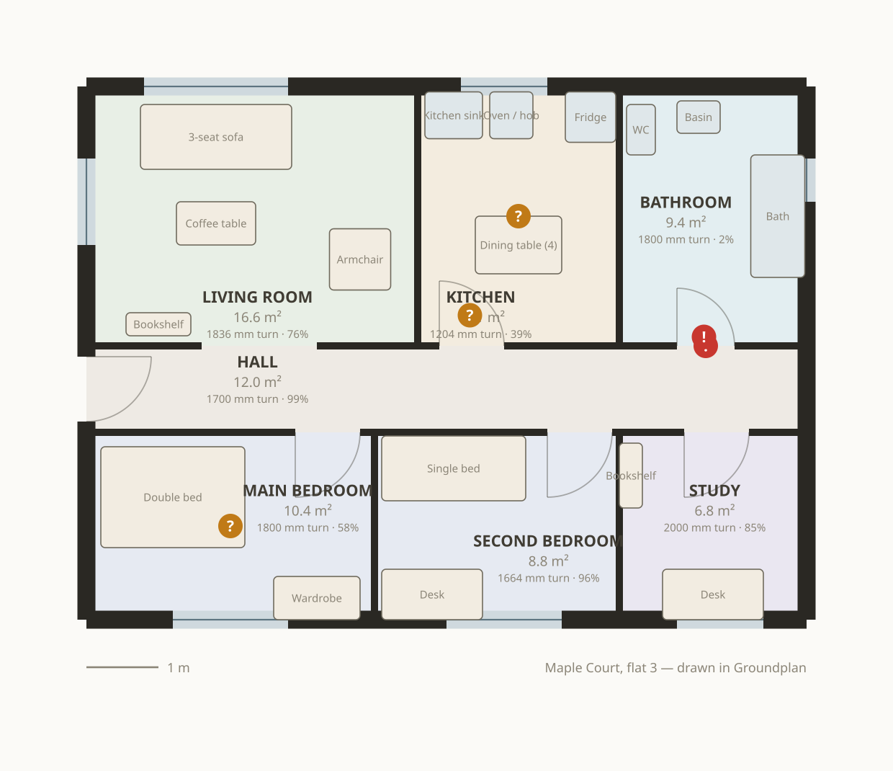
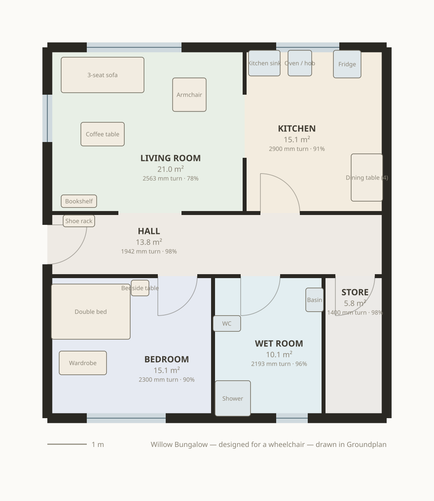

# Groundplan

**Humans draw. Agents measure.**

A floor plan studio whose geometry engine is exposed to AI agents as [WebMCP](https://github.com/webmachinelearning/webmcp) site tools. An agent can read your drawing, measure it against real accessibility standards, and propose repairs — and every change it makes is drawn on the plan in violet and waits at a consent dialog until you approve it.

Built for [The WebMCP Challenge](https://webmcp.devpost.com/).



---

## The problem

Nearly every home is designed by someone who cannot see the thing that will make it unusable.

A doorway 100 mm too narrow does not look narrow. A kitchen without a 1500 mm turning circle looks fine on paper. A wardrobe parked in the wrong place quietly cuts a bedroom in half for anyone using a wheelchair, a walker, or a pushchair. These are not aesthetic mistakes — they are geometric ones, invisible to the eye and obvious to a measurement.

Meanwhile the people who most need to check these things — someone adapting a home after an injury, a carer assessing a flat, a small landlord doing an accessibility retrofit — do not have architects on retainer, and cannot drive professional CAD.

## What Groundplan does

Open it and you get a two-bedroom flat that looks perfectly reasonable. Ask an agent to check it, and it isn't:

```
error   Doorway into Bathroom is too tight              760 mm  → needs 815 mm
error   Bathroom is unreachable — the route narrows to
        800 mm at the door between Bathroom and Hall    800 mm  → needs 900 mm
warning No turning circle in Kitchen                   1204 mm  → needs 1500 mm
warning Only 39% of Kitchen is usable
warning 68% of the home is step-free reachable
```

The bathroom door is 800 mm. That is 760 mm of clear opening — 55 mm short — and it means a wheelchair user in this flat cannot get to the toilet. Nothing on the drawing looks wrong. The number is wrong.

One tool call fixes it:

```json
{
  "ok": true,
  "approved": true,
  "summary": "Doorway into Bathroom is too tight — Widened the opening from 800 mm to 900 mm.",
  "issues": {
    "before": 6, "after": 4,
    "resolved": ["Doorway into Bathroom is too tight", "Bathroom is unreachable"],
    "introduced": []
  },
  "plan_score": 78
}
```

Score 49 → 78. Step-free reach 68% → 78%. Two findings closed by one 100 mm change, and the agent was told exactly that, in the same round trip.

The other starter plan is a bungalow that passes every rule — a worked example to design against, and proof the checker can say yes as well as no.

## Why WebMCP, specifically

This could not be an MCP server sitting behind an API, and it is worth being precise about why.

**The measurements only exist in the page.** Clearance, reachability and turning circles are computed from a live rasterisation of the drawing at 50 mm. There is no document to upload and no id scheme to learn — the agent measures the thing the user is looking at, in the state they left it, including the wall they dragged ten seconds ago.

**The confirmation is the real UI.** When an agent proposes an edit, the page draws it on the plan — violet for what would appear or move, red for what would go, with arrows showing where things travel — and the tool's promise does not resolve until a person clicks Approve or Discard. A chat bubble asking "shall I widen the door?" is a paraphrase of a change. This is the change.

**The tool set is a function of application state.** WebMCP lets a page register and unregister tools at runtime, so what an agent is *able* to ask for narrows and widens as the user works:

| State | Registered tools |
|---|---|
| Normal editing | 24 |
| Something selected on the canvas | 25 — an `edit_selection` tool appears, scoped to that entity |
| Findings outstanding | `fix_violation` appears, with the live rule ids as its enum |
| **Review mode** | 10 — every mutating tool is unregistered; the agent can look but not touch |
| **A proposal awaiting approval** | 12 — writes withdrawn, `check_proposal` added, so edits cannot queue up behind a decision the user has not made |

That last row has one deliberate exception, and it is the subtlest thing in the codebase: the tool whose call is *currently blocked on the approval* stays registered. Unregistering a tool aborts its running invocation, so withdrawing it would kill the very call waiting for the user's answer. `ToolHost.sync` takes a `keepAlive` list for exactly this.

**Both parties share one history.** Mouse drags, keyboard nudges and tool calls all go through the same `commit()`. The Activity panel shows who did what, and every agent edit has a **revert** button beside it.

## The tool surface

23 base tools plus contextual ones. All lengths are millimetres; every reference resolves by id, exact name, partial name or room type, so `"bathroom"`, `"Bathroom"` and `r3` all work.

### Reading

| Tool | What it gives an agent |
|---|---|
| `get_plan` | Every room with position, size, area, neighbours and external walls; every opening; every item of furniture |
| `check_plan` | All rule findings, each with `measured`, `required`, `unit`, the entities involved and a `fix` phrased as a tool call |
| `analyse_access` | Step-free reachable area, per-room verdicts, every doorway's clear width, and **the width and identity of the tightest point on the route into each room** |
| `measure` | Distance between any two things — or literal `"x,y"` points — plus the clear floor radius at each end |
| `list_catalog` | Real furniture dimensions and the clear floor each item needs in front of it |
| `get_selection` | What the user has selected right now, so "this room" and "that door" resolve |
| `get_activity` | The shared edit history, attributed |
| `export_plan` | A share link carrying the whole drawing in its URL, a markdown room schedule, or the plan as SVG |

### Writing

`add_room` · `edit_room` · `add_opening` · `edit_opening` · `add_furniture` · `edit_furniture` · `furnish_room` · `delete_entity` · `clear_room` · `set_standards` · `undo_last` · `load_sample`

…and **`apply_batch`**, which runs a whole sequence against one draft under a single approval. It is genuinely atomic: if step four is rejected, steps one to three never happened, and the agent is told which step failed and why. Designing a room is one decision for the user, not eleven.

### Collaborating

| Tool | Why it exists |
|---|---|
| `highlight` | The agent points at things and they pulse on the canvas. Talking about a plan without pointing at it is hard |
| `set_view` | Turns the clearance heatmap and reach overlay on and off, so the agent can *show* what it measured rather than describing it |

### Contextual

| Tool | Appears when |
|---|---|
| `fix_violation` | Anything is failing. Applies the canonical repair — widen the door that is actually pinching the route, add the window, re-park whatever is eating the turning circle |
| `edit_selection` | The user has something selected |
| `check_proposal` | A change is waiting for approval |

### How the tools are written

Three decisions did most of the work:

1. **Failures are prose with a `hint`, never exceptions.** `add_opening` does not just refuse a 1600 mm door — it says *"a 1600 mm opening will not fit the 1200 mm north wall of the Hall; the widest that fits with jambs is 1000 mm."* Models correct that on the next call. They do not correct a stack trace.

2. **Mutations report their effect on the rules.** Every write returns `issues.resolved` and `issues.introduced`. The agent finds out whether the edit *helped* without a second round trip, which is what turns a sequence of calls into a convergent loop.

3. **Findings name the culprit, not the symptom.** "The bathroom is unreachable" is useless. "The route narrows to 800 mm at the door between Bathroom and Hall" tells an agent precisely which of the seven doors to widen — and the finding carries that opening's id.

## How the measurements work

`src/core/grid.ts` is the honest bit.

1. **Rasterise** the plan at 50 mm — rooms become floor, wall bands straddle every shared edge, doors and archways are carved back out, windows stay solid, furniture footprints are burned in.
2. **Exact Euclidean distance transform** (Felzenszwalb & Huttenlocher) over the obstacle set gives the **clear radius at every square of floor**. That single field yields turning circles and doorway clear widths.
3. **Flood fill from the front door**, restricted to cells whose clearance is at least the mobility radius. A doorway narrower than the body simply does not connect.
4. **Dilate the result by the same radius** to get the floor that body actually *sweeps* — what a person means by "how much of my home can I get to".
5. **Widest-path search** — Dijkstra with `min` in place of `+` and a max-heap — gives, for every square of floor, the widest body that could ever reach it, and the path it took. Walking that path back finds the pinch point, and matching the pinch against the openings names the door responsible.

Step 5 is what makes the tool results actionable rather than merely correct. Toggle **Clearance heatmap** to see step 2 and **Step-free reach** to see steps 3–4.

## The rules

| Rule | Checks |
|---|---|
| `door.clear_width` | Clear opening ≥ 815 mm (ADA/ANSI A117.1) |
| `access.unreachable` / `access.partial` | Can a 900 mm body get there from the front door — and if not, what is pinching |
| `access.turning_circle` | 1500 mm clear circle in living, bed, kitchen, bathroom |
| `plan.circulation` | Share of the home that is step-free reachable |
| `room.min_area` / `room.min_dimension` | Habitable room minimums |
| `room.daylight` | Glazing ≥ 10% of floor area (5% for kitchens) |
| `bedroom.egress` | Every bedroom has an openable escape window |
| `room.no_door` / `plan.no_entry` | Nothing sealed; the home has a front door |
| `door.swing_clash` | The leaf can open without hitting furniture |
| `furniture.approach` | The clear floor each fitting needs in front of it is actually clear |
| `furniture.overlap` / `furniture.outside` | Nothing occupies the same floor or sticks through a wall |
| `room.overlap` | Rooms meet edge to edge, never intersect |
| `kitchen.work_triangle` | Sink–hob–fridge triangle within 3.6–6.6 m (advisory) |

Thresholds follow widely used residential guidance — ADA/ANSI A117.1 and ISO 21542 for clearances, typical habitable-room minimums elsewhere. They are adjustable at runtime via `set_standards`, because a plan checked for a walking frame is a different plan from one checked for a wheelchair. **Groundplan is a design aid, not a code compliance certificate.**

## Getting things out

Nothing is ever uploaded, so everything leaves the same way it arrived — in the page.

- **Share link** — the whole plan, compressed into the URL fragment. It works with no server behind it, and `export_plan` lets an agent hand someone a link to the plan it just fixed.
- **SVG** — vector, opens anywhere. The drawings in this README are generated by that same exporter (`npm run docs:render`), so they cannot drift from the code.
- **Room schedule** — a markdown table of areas, turning circles and route widths, for pasting into a message.
- **PNG** — the current view.

## Keyboard and screen readers

A tool about accessible design that cannot itself be used from a keyboard would be a poor advertisement for the idea.

| Key | Does |
|---|---|
| `.` / `,` | Move through every room, opening and item in turn |
| Arrow keys | Nudge the selection 50 mm (Shift 10 mm, Alt 500 mm); pan when nothing is selected |
| `+` / `−` / `0` | Zoom in, out, fit |
| `Escape` | Deselect |
| `Delete` | Remove the selection |
| `Ctrl/⌘ Z`, `Shift Ctrl/⌘ Z` | Undo, redo |

The canvas is focusable and labelled, every control has an accessible name, the rail is a real tablist, and a live region announces the selection and the current findings count. Animation respects `prefers-reduced-motion`.

## Running it

```bash
npm install && npm run dev
```

Then open <http://localhost:5173>.

```bash
npm test          # 50 unit tests over the geometry, grid, rules, ops and exports
npm run build     # type-check and bundle to dist/ — a static site, no backend
npm run docs:render   # regenerate the drawings in docs/
```

## Driving it with an agent

- **ChatGPT's built-in browser** — open the page and the tools appear under *Site tools* in the address bar.
- **Chrome 146+** with the `webmcp` flag enabled uses `document.modelContext` natively.
- **Anywhere else** the page loads the [`@mcp-b/global`](https://www.npmjs.com/package/@mcp-b/global) polyfill on demand, so a WebMCP browser extension can drive it. The badge in the header tells you which host you got.
- **No agent at all** — open the **Site tools** tab in the right-hand rail. It lists everything currently registered, with schemas, and runs any of them by hand. It is the identical function an agent calls.

Things worth asking for:

> Check this flat for wheelchair access and fix whatever fails.

> Which door is stopping me getting to the bathroom, and how much wider does it need to be?

> Turn on the clearance heatmap and tell me which room is worst.

> I'm selecting the second bedroom — can a double bed and a wardrobe fit with a turning circle?

> Load the empty shell and design a one-bedroom flat for a wheelchair user, then send me a link.

Without WebMCP support the app is an ordinary, complete floor plan editor. That progressive-enhancement contract is deliberate.

## Architecture

```
src/
  core/
    types.ts      Plan model. Integer millimetres throughout — no float geometry anywhere
    geometry.ts   Rectangles, shared wall segments, wall runs, openings, swings, approach zones
    grid.ts       Rasterisation, exact EDT, clearance field, reachability, widest-path routing
    rules.ts      The rule engine — every finding carries measured, required and a fix
    fixes.ts      Canonical repairs behind fix_violation
    ops.ts        The only functions that mutate a plan; shared by mouse, keyboard and tools
    catalog.ts    Furniture with real dimensions and clear-floor requirements
    samples.ts    Starter plans — one flawed on purpose, one that passes everything
    svg.ts        Vector export and the markdown room schedule
    share.ts      Plans compressed into a URL fragment
    store.ts      State, undo history, the shared activity feed
  mcp/
    runtime.ts    Host detection (native → polyfill) and the register/unregister diff
    operations.ts Arguments to mutations — one dispatcher for single tools and batches
    tools.ts      The tool surface
    gate.ts       The consent gate: proposals, change descriptions, issue deltas
  ui/
    canvas.ts     The drawing sheet, direct manipulation, keyboard control, ghost previews
    app.ts        Header, findings, activity, tool inspector, approval card, exports
tests/            50 tests over geometry, occupancy, routing, rules, batching and exports
```

No framework, no backend, no telemetry. TypeScript in strict mode, built with Vite.



## Licence

MIT — see [LICENSE](LICENSE).
